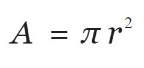
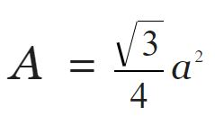

# Final Exam Prep

<details>
  <summary>
    ✅ Part 1. While loop and built-in functions - (10 pts)
  </summary>

  <details>
    <summary>
      Practice Example 1:
    </summary>
 
  - write a while loop to
    - generate a random integer between two user input values
    - you must do validation to only allow integer values
    - if this random number is the radius of a circle, calculate the area of the circle. The formula to calculate area is 
    - pi = 3.142
    - Print `The area of circle with radius {random number} m is {calculated area rounded to three decimal places} sq. m.`
    - until user presses x or X
</details>


<details>
    <summary>
      Practice Example 2:
    </summary>
  
  - write a while loop to
    - generate a random float between two user input values
    - you must do validation to only allow floats greater than 0
    - if this number is the side of an equilateral triangle, calculate the area. The formula to calculate area is 
    - print `The area of the triangle with side {random number} ft. is {calculated area rounded to two decimal places} sq. ft.`
    - until user presses 0
  </details>
</details>


  <details>
    <summary>
      ✅ Part 2. Files, Functions and Exceptions - (20 pts)
    </summary>
<details>
  <summary>
    Practice Example 1:
  </summary>
  
  - given the products.txt file
  - Product Name, Product ID, Product Price, Product Category, Product Quantity one in each line, in that order
  - user will enter Product ID
  - if product ID present,
  - display all the details of that product
  and
  - modify the product price to user entered value (validate user input to be float greater than zero)
  - if not present, print `Product Not Found`
  - use Option 2
  - handle all potential exceptions
</details>


<details>
  <summary>
    Practice Example 2:
  </summary>

  - given the products2.txt file
  - Product Name, Product ID, Product Price, Product Category, Product Quantity in that order, separated by commas
  - user will enter Product ID
  - if product ID present,
  - display all the details of that product
  - modify the product quantity to a user entered value, validate user input to be an integer
  - if not present, print Product Not Found
  - use Option 3
  - handle all potential exceptions
</details>
  
  </details>


<details>
  <summary>
    ✅ Part 3. Dictionary Manipulation - (20 pts)
  </summary>

  - Unpickle the dictionary stored in employees.bin in the datafiles folder
  - Practice the following operations. You will get a different dictionary in the exam and only five operations to perform
    
  1. Change employee's name ID 04568 to Roger Stevens
  2. For emp ID 04567 add a new certification EVA-L2 taken on March 22, 2023
  3. Add a new title - SGA President - for Riva Malik (you don't know her emp ID)
  4. For all the programmers, give a salary **increment** of 5000
  Must be case in-sensitive, i.e. you have to look for Programmer or PROGRAMMER or programmer as title 
  Hint: you may have to use list comprehension to convert all the titles to lowercase
  5. Add a new certification OCPL1 for emp 04569 taken on March 10, 2023
  6. Assign the project Compete to Roger Stevens (you don't know the emp ID)
  7. For Riva Malik, remove any previous titles and add Casual Wage Worker as the only title
  8. Compete project is taken over by Spring Valley, so change all occurrences of that project with the new name
  9. For anyone who has a certification that starts with OCPL1, add a title called Oracle Developer
  10. Ask the user for a certificate code and print the names of all the employees that have that certificate. Must be case-insensitive. If name is not available, print the emp ID
  11. Print the name and salaries of all the employees who are working on the project Spring Valley. Choose a nice format and alignment so they are displayed in a tabular fashion (name, left aligned over 20, salary right aligned over 8. If either name or salary not available, print -
  Hint: must use end in print statement
  12. Ask user for a new certification code and date taken and add that for emp ID 4571. Cert code must be all uppercase. Assume user will give good value for data in YYYY-MM-DD format
  13. Add a new title - Developer - for an employee name entered by the user, do a case-insensitive comparison 
  14. For all the employees working on Mayfield Inc, give a 25% raise in their salary. If anyone doesn't have a salary, set their salary at 65000
  15. Add a new certification OCPL1 for all employees in the IT department (IT is case-insensitive, could be it, It, iT) taken on March 10, 2023
  16. Print the name, salary and department of all the employees with more than one certification (in a tabular fashion), if name or salary or dept not available, print -
  17. Ask the user for an employee name and a title that he wants to add to this employee and add it. First letter of each word of name and title must be uppercase
  18. For anyone who has a SCJP certification, add a title called Java Developer, must be case-insensitive search
  19. Check the dictionary for any employee who might be missing a name, and if missing, print their ID and ask the user to set a name. Make sure that name doesn't have any special characters except space and first letter of each word must be uppercase. (You may implement it in a function named validate_name, or just a while loop)
  20. Print the names of employees with salaries more than 50000, skip employees that don't have a name
  21. Ask user to enter a department and display in a tabular format names, salaries of all the people in that department. Search for department must be case-insensitive. If names or salaries not available, print -. Choose your alignment and widths.
  
  - Pickle to modified_employees.bin the datafiles folder
</details>

<details>
  <summary>
    ✅ Part 4. Classes and Inheritance - (20 pts)
  </summary>

  In classes.py
  - Write a class named `Person`
    - Data attributes are
      - name
      - address
      - telephone number
    - Write init to initialize these as protected attributes
    - Write get and set methods for all these attributes
  - Write a class named `Customer` that is a subclass of the `Person` class.
    - The Customer class has additional data attributes
      - Customer number
      - MailingList (this is a Boolean data attribute indicating whether the customer wishes to be on a mailing list)
    - Call parent init to initialize name, address, telephone number
    - Write init to initialize cutomer number and mailing list as private attributes
    - Write str to return all five data attributes in a good format

  In functions.py inside part5()
  - Create an object of Customer with values
    - John Cena
    - 2456 Topeka Dr, Springfield, IL
    - 8567975421
    - 4567
    - True
  - Change the name to John Rivera using the appropriate method
  - Print whether the above customer is signed up for mailing list using the appropriate get method
  - Print all the data regarding this customer
</details>


<details>
  <summary>
    ✅ Part 5. Database Programming - (20 pts)
  </summary>

<details>
  <summary>
    Practice Example 1: Books Database
  </summary>

  1. GET CONNECTION TO datafiles/books.db
  2. GET CURSOR for the above connection
  3. CREATING TABLE if it doesn't exist
  Table Name is  Books  
  Has four columns  
  ISBN is integer primary key  
  Book Title is String  
  Book Price is Float  
  Book Author is String  
  4. INSERT DATA INTO THE TABLE using date obtained from the following input statements
```python
  title = input("Enter the title: ")
  price = float(input("Enter the Price: "))
  author = input("Enter the Author: ")
```
  5. COMMIT CHANGES
  6. CLOSE CONNECTION
  
</details>


<details>
  <summary>
    Practice Example 2: Products Database
  </summary>
  
  1. GET CONNECTION TO datafiles/products.db
  2. GET CURSOR for the above connection  
     ## products table has 4 columns 
  `ProdID, ProdName, ProdPrice, ProdQty`  
  
  3. RETRIEVE ALL ROWS AND PRINT THEM IN A TABLE (use your own format to fit data)  
    a. In Ascending Order of the Product Name  
    b. In Descending Order of the Product Price
  4. RETRIEVE ROWS THAT FIT A CRITERIA AND PRINT THEM  
    a. All products costing more than $30  
    b. All Products (Get just product names) with quantity more than 60
  5. AGGREGATE FUNCTIONS  
    a. Print the average price of the products in the store  
    b. Print how many total products are in the store  
    c. Print the total price of all the products in the library  
    d. Print the name and price of the most expensive product in the store (needs query inside a query, such operations will be for Bonus points only)  
    e. Print the name and price of the least expensive product in the store (needs query inside a query, such operations will be for Bonus points only)
  6. UPDATE AND PRINT HOW MANY ROWS WERE AFFECTED  
    a. Change product quantity to 10 if the product quantity is less than 10
  7. DELETE AND PRINT HOW MANY ROWS WERE AFFECTED  
    a. Delete products with price more than $90  
  8. COMMIT CHANGES
  9. CLOSE CONNECTION

</details>
</details>

